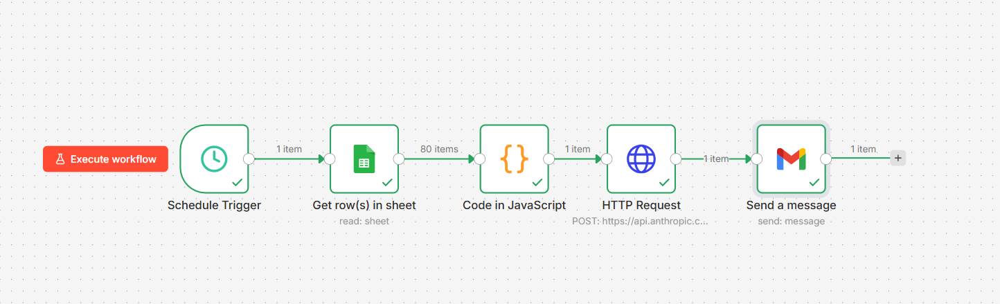
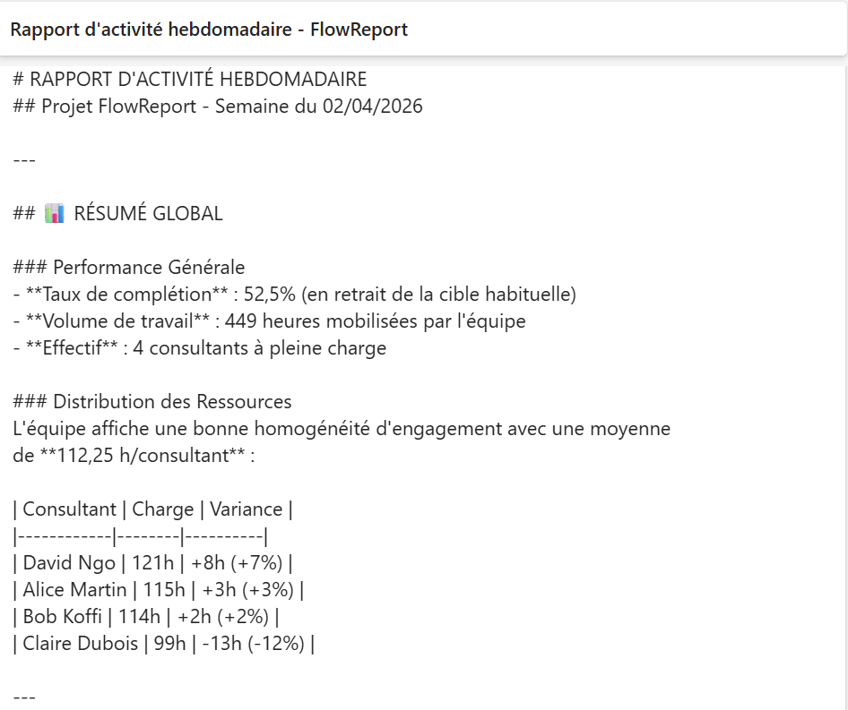

# 🟠 FlowReport : Pipeline d'automatisation IA de rapports de performance

> Projet personnel réalisé dans le cadre d'une formation MBA Big Data & IA,
> pour développer des compétences concrètes en automatisation et IA générative.

## 📌 Problématique

Dans les ESN (Entreprises de Services du Numérique), le suivi d'activité
des équipes projet est une tâche critique mais chronophage. Chaque semaine,
les managers doivent :

- Collecter les données d'activité auprès de chaque consultant ;
- Consolider manuellement les informations dans des tableaux de bord ;
- Analyser les KPIs : taux de complétion, tâches bloquées, charge par consultant ;
- Rédiger un rapport de performance à destination de la direction ou du client.

Ce processus représente **2 à 3 heures par semaine** de travail répétitif,
source d'erreurs humaines et difficilement scalable à mesure que l'équipe grandit.

**FlowReport automatise ce cycle de bout en bout** : de la lecture des données
à la génération du rapport narratif par l'IA, jusqu'à son envoi automatique
au manager chaque lundi matin — sans aucune intervention humaine.

**Résultat : réduction estimée du temps de reporting de 80%.**

## ⚙️ Architecture du pipeline
```
[Google Sheets] → [n8n] → [Calcul KPIs] → [API Claude] → [Rapport email]
```

## 🚀 Fonctionnalités

- Lecture automatique des données d'activité depuis Google Sheets
- Calcul des KPIs : taux de complétion, heures par consultant, tâches bloquées
- Génération d'un rapport narratif par IA (Claude API)
- Envoi automatique par email chaque lundi à 8h

## 🛠️ Stack technique

| Outil | Rôle |
|---|---|
| n8n | Orchestration du pipeline |
| Google Sheets | Source de données |
| API Claude (Anthropic) | Génération du rapport IA |
| Gmail | Envoi automatique |

## 📂 Structure du repo
```
flowreport/
│
├── data/
│   └── sample_data.csv          ← 80 tâches, 4 consultants, 4 semaines
│
├── n8n/
│   └── workflow.json            ← Pipeline exporté (clé API remplacée par VOTRE_CLE_API)
│
├── prompts/
│   └── report_prompt.txt        ← Prompt Claude documenté et versionné
│
├── output/
│   └── sample_report.html       ← Rapport HTML final généré par l'IA
│
├── docs/
│   ├── pipeline_n8n.png         ← Capture du workflow n8n
│   ├── rapport_email.png        ← Capture du rendu email HTML
│   └── méthodologie.md          ← Approche projet, phases, décisions techniques
│
└── README.md                    ← Documentation pro + architecture + screenshots

```

## 🖼️ Aperçu

### Pipeline n8n


### Rapport généré par IA


Voir [`output/sample_report.txt`](output/sample_report.txt)

## ⚠️ Sécurité

Ne jamais committer de clé API.
Remplacer `VOTRE_CLE_API_ANTHROPIC` dans `n8n/workflow.json`
par votre propre clé via les credentials n8n.

## 👤 Auteur

**Déhollin HOLLAT** — Chef de Projet Data IA  
